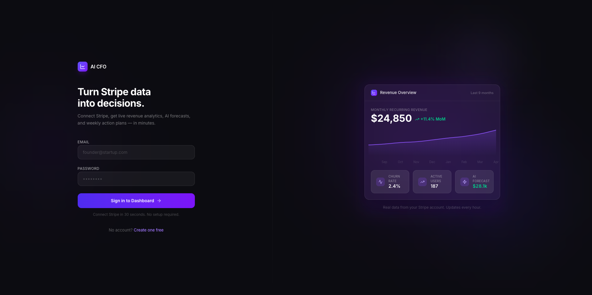
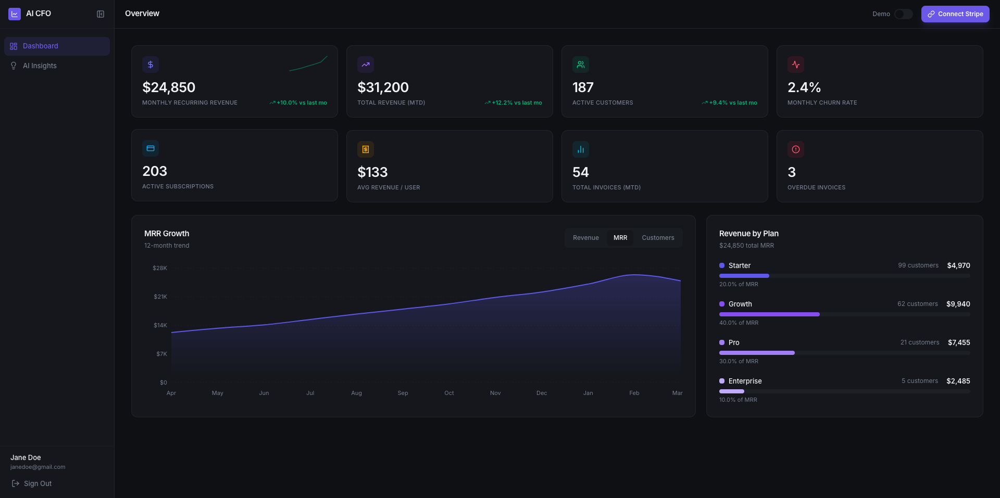
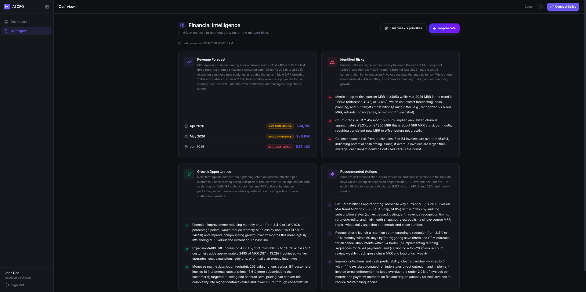
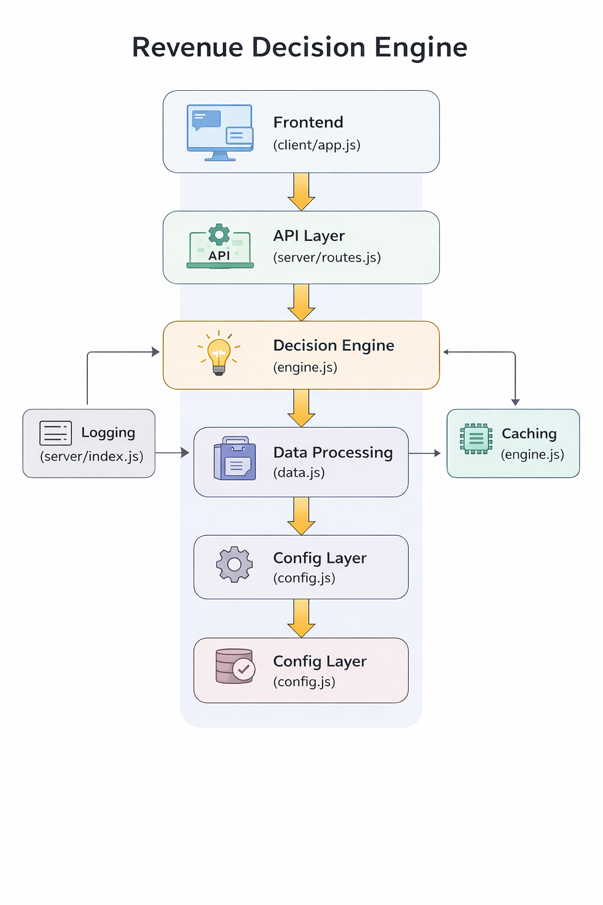

# Revenue Decision Engine

Turn your Stripe data into clear, actionable decisions.

## What it does

Connects to Stripe and converts revenue, churn, and customer data into weekly actions like pricing changes, retention moves, and growth opportunities.

## Why it exists

Most tools show dashboards. They don’t tell you what to do next. This focuses on decisions, not reporting.

## Example output

“Churn increased in SMB segment → test a lower entry tier”

“Expansion revenue flat → target top 20% of customers for upsell”

“MRR growth slowing → adjust pricing or acquisition mix”

## Tech Stack

* React
* Node.js / Express
* PostgreSQL
* OpenAI API
* Stripe API

## Screenshots

### Landing Page

### Dashboard

### AI Insights

## Architecture

The system processes inputs through an API layer, applies decision logic, and returns optimized revenue recommendations.

